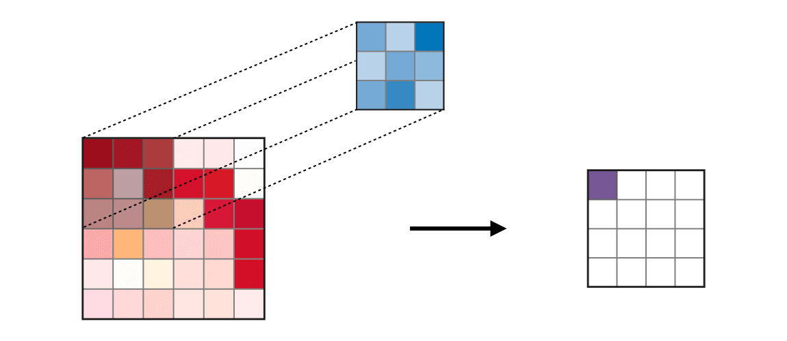
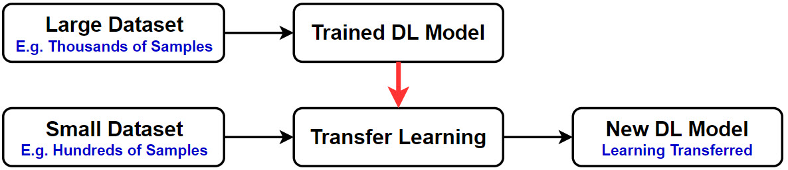

```{r setup, include=FALSE}
knitr::opts_chunk$set(echo = TRUE, fig.align = "center")
```

<style>
body {
text-align: justify}
</style>

# Introduction

Many national parks or wildlife conservation use camera trap to monitor and manage the wildlife activities while also preventing any illegal poacher. These camera traps are essential for people to study population sizes and  distributions of animals and also evaluate habitat use.

```{r echo=FALSE, out.width="80%"}

```

The problem is that extracting information from the camera is very time consuming if done manually by human. With the advent of technology, Deep Learning allow people to process data and become an intelligent machine that can replace manual labor work with an autonomous one, giving human more meaningful work and let the machine do the mundane task with the same or even better performance than human. The task of extracting information, such as identify species of animals and their number from millions of image data from camera traps can be done by Deep Learning[^1].

```{r echo=FALSE, out.width="80%"}
knitr::include_graphics("assets/face.jpg")
```

Image recognition and classification is one of many application from the Neural Network. The dream of building a machine that can see the world as we do, or even better, will help humanity in many areas. Their real life application and potential is limitless, from detecting defect during manufacturing production, identify human faces, diagnosing disease, autonomous vehicle, automatic image captioning, etc. One of the interesting application is for wildlife monitoring and conservation.

On this article, we will try to build a Neural Network model that will identify 10 different monkey species. The data can be found publicly at [Kaggle](https://www.kaggle.com/slothkong/10-monkey-species).

# Library and Setup

The following packages are required to replicate all codes in this article.

```{r message=FALSE, warning=FALSE}
# Data Wrangling
library(tidyverse)

# Modelling
library(keras)

# Image Manipulation
library(imager)

options(scipen = 999)
```

# Exploratory Data Analysis

Before we build the model, first we will explore and get more familiar with the data. The following table is the meta data for each class category. We have 10 differents species of monkey with unique appearance. The dataset is quite small, with only a total around 1,000 training samples and around 270 validation dataset.

```{r}
df_meta <- read.delim("data/monkey_labels.txt", 
           sep = ",") %>% 
  mutate(
    Latin.Name = str_remove_all(Latin.Name, "\t"),
    Common.Name = str_replace_all(Common.Name, "_", " ") %>% str_trim() %>% str_to_title(),
    Label = str_trim(Label)
  )

df_meta
```

We can inspect some images from the data. The following is the example of image from the first monkey species : the Mantled Howler, which is famous for their loud howling sound.

```{r}
temp_image <- list.files("data/training/training/n0/", pattern = ".jpg")

image_1 <- load.image(paste0("data/training/training/n0/", temp_image[38]))

plot(image_1)
```


The following is the sample of the species of Patas monkey from the Africa.

```{r}
temp_image <- list.files("data/training/training/n1/", pattern = ".jpg")

image_2 <- load.image(paste0("data/training/training/n1/", temp_image[5]))

plot(image_2)
```

We might also want to see if all classes have balanced proportion. The proportion of each class is quite balanced (around 10%) and doesn't have too much difference, so we can proceed to process the data.

```{r}
df_meta %>% 
  mutate(
    prop = Train.Images/ sum(Train.Images)
  ) %>% 
  ggplot(aes(prop, reorder(Common.Name, prop))) +
  geom_point(size = 3) +
  geom_segment(aes(x = 0, xend = prop, y = Common.Name, yend = Common.Name)) +
  theme_minimal() +
  scale_x_continuous(labels = scales::percent_format()) +
  labs(y = NULL, x = "Proportion", title = "Proportion of Each Class in Training Set")
```


# Data Preprocessing

## Image Augmentation

Since we have a little amount of training set, we will build artificial data using method called Image Augmentation. Image augmentation is one useful technique in building models that can increase the size of the training set without acquiring new images. The goal is that to teach the model not only with the original image but also the modification of the image, such as flipping it, rotate it, zooming, etc. This will create more robust model. We can do data augmentation by using the image data generator from `keras`.

```{r echo=FALSE, out.width="80%"}
knitr::include_graphics("assets/augment.png")
```

We will reduce the dimension of all image into 128 x 128 pixels. The model will be trained with the training dataset gradually in batches so that it can learn better compared to if we fed all the data simultaneously. The pixel values will be scaled by dividng the value with 255, since the range value for a color pixel is [0, 255]. The model will be trained using the original color image (rgb) and will be transformed into grayscale.

```{r}
# Desired height and width of images
target_size <- c(128, 128)

batch_size <- 32

train_data_gen <- image_data_generator(horizontal_flip = T, 
                                       vertical_flip = T, 
                                       rescale = 1/255,
                                       rotation_range = 45, 
                                       width_shift_range=0.2,
                                       height_shift_range=0.2,
                                       zoom_range = 0.2, 
                                       shear_range = 0.2,
                                       fill_mode = "nearest")

# Data Generator for Training Set
train_image_array_gen <- flow_images_from_directory(directory = paste0(getwd(),"/data/training/training/"),
                           target_size = target_size, 
                           color_mode = "rgb", 
                           batch_size = batch_size, 
                           seed = 123, 
                           generator = train_data_gen)

# Data Generator for Validation Set
validation_image_array_gen <- flow_images_from_directory(directory = paste0(getwd(),"/data/validation/validation/"),
                           target_size = target_size, 
                           color_mode = "rgb", 
                           batch_size = batch_size, 
                           seed = 123, 
                           generator = train_data_gen)

# Number of training samples
train_samples <- train_image_array_gen$n

# Number of validation samples
valid_samples <- validation_image_array_gen$n

# Number of target categories
output_n <- 10
```

# Modelling

We will use two different approach for the problem: 

- **Build our own Neural Network model**

We will build the model from the scratch by using layers called the Convolutional Neural Network[^2], which is the most suitable type of network to handle image data processing. You can see the explanation from [MIT](https://www.youtube.com/watch?v=iaSUYvmCekI&list=PLtBw6njQRU-rwp5__7C0oIVt26ZgjG9NI&index=4&t=0s) for introduction to Deep Learning and Convolutional Neural Network. 

```{r echo=FALSE, out.width="80%"}

```


- **Use the Pre-Trained Model**

There are already some pre-trained model within the *Keras* framework. Some of them can be seen [here](https://keras.io/api/applications/). The pre-trained models are some of the best model architecture that has been built, and often called as the state-of-the-art (SOTA). We will build our model on top of one the listed model. The concept of using pre-trained model to solve a specific problem (in this case, our problem of classifying monkey image) is called Transfer Learning[^3].

```{r echo=FALSE, out.width= "80%"}

```

## Model Architecture

This is our model architecture. The Convolutional Layer will do feature extraction and detect various features from the images, while the Pooling layer will reduce the dimension of the preceding Convolutional Layer by only taking the maximum value from each filter. Finally, before the data is processed and presented in the output layer, the Global Average Pool will convert the 3-dimensional data from the Convolution layer by took only the average value from each filter and make a long vector. The Gloval Average Pool is better than flattening the Convolution layer than use another Fully-Connected (Dense) layer, since the Dense layer is tend to overfit and take more time to compute. The manually built model is quite simple since more complex model means more computation time. 

```{r eval=FALSE}
tensorflow::tf$random$set_seed(123)

model <- keras_model_sequential(name = "Monkey_Eye") %>%
  
  # Conv 1
  layer_conv_2d(filter = 32, kernel_size = c(3,3), 
                padding = "same", activation = "relu",
                input_shape = c(target_size[1], target_size[2], 3),
                name = "block1_conv") %>%
  
  layer_max_pooling_2d(pool_size = c(2,2),
                       name = "block1_pool"
                       ) %>%
    
   # Conv 2
  layer_conv_2d(filter = 64, kernel_size = c(3,3), 
                padding = "same", activation = "relu",
                name = "block2_conv"
                ) %>%

  layer_max_pooling_2d(pool_size = c(2,2),
                       name = "block2_pool"
                       ) %>%
    
  # Conv 3
  layer_conv_2d(filter = 128, kernel_size = c(3,3), 
                padding = "same", activation = "relu",
                name = "block3_conv"
                ) %>%

  layer_max_pooling_2d(pool_size = c(2,2), 
                       name = "block3_pool"
                       ) %>%
  
  # Conv 4
  layer_conv_2d(filter = 128, kernel_size = c(3,3),
              padding = "same", activation = "relu",
              name = "block4_conv"
              ) %>%

  layer_max_pooling_2d(pool_size = c(2,2),
                       name = "block4_pool"
                       ) %>%
    
  # Conv 5
  layer_conv_2d(filter = 256, kernel_size = c(3,3),
              padding = "same", activation = "relu",
              name = "block5_conv"
              ) %>%

  layer_max_pooling_2d(pool_size = c(2,2),
                       name = "block5_pool"
                       ) %>%
    
  # Conv 6
  layer_conv_2d(filter = 512, kernel_size = c(3,3),
              padding = "same", activation = "relu",
              name = "block6_conv"
              ) %>%

  layer_max_pooling_2d(pool_size = c(2,2),
                       name = "block6_pool"
                       ) %>%

  layer_global_average_pooling_2d(name = "average_pool") %>% 

  layer_dropout(rate = 0.3, name = "dropout") %>% 
  
  layer_dense(512, activation = "relu", name = "dense_1") %>% 

  # Output layer
  layer_dense(units = output_n, activation = "softmax",
              name = "output"
              )

# Compile model
model %>% 
  compile(
    loss = "categorical_crossentropy",
    optimizer = optimizer_adam(lr = 0.001),
    metrics = "accuracy"
)
```


```{r echo=FALSE}
model <- load_model_hdf5("monkey_eye.hdf5")
model
```

## Train Model

The model will be trained with batch size of 32, which mean that the model will update its weight after trained with 32 samples of data. To ensure that our model has learned properly, we will use the number of epoch to 200.

```{r eval=FALSE}
model %>% 
  fit_generator(
  # training data
  train_image_array_gen,
  
  # epochs
  steps_per_epoch = as.integer(train_samples / batch_size), 
  epochs = 200, 
  
  # validation data
  validation_data = validation_image_array_gen,
  validation_steps = as.integer(valid_samples / batch_size),
  
  # print progress
  verbose = 1,
  view_metrics = 0
)
```


## Model Evaluation

Finally, we will evaluate the model. First we prepare the actual class label for each observations.

```{r message=FALSE}

img_name <- sapply(0:9, function(x) list.files(paste0("data/validation/validation/n", x,"/"), pattern = ".jpg")) %>% 
  unlist() %>% 
  as.data.frame() %>% 
  rename("file" = ".") %>% 
  mutate(
    Label = substr(file, start = 1, stop = 2),
    dir = paste0("data/validation/validation/", Label, "/", file),
    class = substr(Label, start = 2, stop = 2) %>% as.numeric()
  ) %>% 
  left_join(df_meta %>% select(Label, Common.Name)) %>% 
  mutate(
    Common.Name = as.factor(Common.Name)
  )

head(img_name)
```

The next step is to prepare our image by converting them into an array in order to be predicted.

```{r}
image_prep <- function(x) {
  arrays <- lapply(x, function(path) {
    img <- image_load(path, target_size = c(128, 128))
    x <- image_to_array(img)
    x <- array_reshape(x, c(1, dim(x)))
    x <- x/255
  })
  do.call(abind::abind, c(arrays, list(along = 1)))
}

test_x <- image_prep(img_name$dir)

dim(test_x)
```

Next, we predict the data test using the model. We would like to get the probability for each prediceted class in order to get the top 3 class prediction for each observations.

```{r}
pred_test <- predict(model, test_x)
head(pred_test %>% round(4))
```

We will sort the probability for each observation and pick the top 3 probabilities as the class prediction. For example if an observation has the following prediction probabilities:

```{r}
first_test <- pred_test[5, ]
names(first_test) <- df_meta$Common.Name

sort(round(first_test, 4), decreasing = T)
```

The top 3 class prediction would be : 

1. Nilgiri Langur

2. White Headed Capuchin

3. Mantled Howler

```{r}
top_3_pred <- pred_test %>% 
  as.data.frame() %>% 
  setNames(df_meta$Common.Name) %>% 
  apply(MARGIN = 1, function(x) sort(x, decreasing = T) %>% head(3) %>% names() %>% as.character()) %>% 
  t() %>% 
  as.data.frame() %>% 
  setNames(paste0("pred", 1:3)) %>% 
  mutate(
    class_actual = img_name$Common.Name
  )

top_3_pred
```

### Top-N Accuracy

We will evaluate the model based on the accuracy on the predicted class. First, we would love to see the accuracy if the top prediction (highest probability). This is called the Top-1 accuracy because we only consider the prediction with the highest probability.

```{r}
top_3_pred %>% 
  mutate(
    correct = ifelse( pred1 == class_actual, T, F)
  ) %>% 
  count(correct) %>% 
  mutate(proportion = n / sum(n)) 
```

We have accuracy of 80.9% for the top prediction. However, since we have a lot of classes in the target variable, relying only on the highest probability might be misleading. Also, the dataset is all about monkey, so perhaps some monkey share same similarity in certain aspecs. Thus, we would also consider other classes with the next highest probability. For example, we have the following data:

- actual label : rabbit
- prediction (sorted by probabilities) : dog (0.75), cat (0.1), rabbit (0.07), tiger (0.05), wolf (0.03)

If we only use the top prediction (dog), then we conclude that our model is wrong. However, if we consider the dog, cat, and rabbit (top 3 prediction), we conclude that our model is correct because the predicted label has rabbit in it. If any of the top 3 predictions are matched with the actual label, then we consider the model correctly predict the class. This metric is called Top-N accuracy since we use the top N prediction from the model.

Now we would check what is the model accuracy if we consider the top 2 prediction (Top-2 Accuracy).

```{r}
top_3_pred %>% 
  mutate(
    correct = ifelse( pred1 == class_actual | pred2 == class_actual, T, F)
  ) %>% 
  count(correct) %>% 
  mutate(proportion = n / sum(n)) 
```

The accuracy is significantly improve from 80.9% to 90%. Next, we would also check the Top-3 Accuracy.

```{r}
top_3_pred %>% 
  mutate(
    correct = ifelse( pred1 == class_actual | pred2 == class_actual | pred3 == class_actual, T, F)
  ) %>% 
  count(correct) %>% 
  mutate(proportion = n / sum(n))
```

Again, the model accuracy increase from 90% to 94%. This illustrate that sometimes evaluating the model using only the prediction with highest probability (Top-1 Accuracy) is not enough.

We will not consider the Top-4 or even Top-5 accuracy since our data only has 10 classes. By using bigger and bigger N, the metric may not be so reliable because we consider almost all prediction from the model.

### Other Metrics

We might also want to check the other metrics that is derived from confusion matrix, such as the recall and precision for each class. Based on the matrix, we can see that the model has poor performance on identifying some species, such as the Patas Monkey and Mantled Howler, based on the Recall and F1 value. Low value of recall indicate that out of all image of Patas Monkey, only some of them that can be correctly identified by the model.

```{r}
conf_matrix <- caret::confusionMatrix(as.factor(top_3_pred$pred1), top_3_pred$class_actual)

conf_matrix$byClass %>% 
  as.data.frame() %>% 
  rownames_to_column("label") %>% 
  mutate(
    label = str_remove(label, "Class: ")
  ) %>% 
  select(label, Sensitivity, Specificity, Precision, Recall, F1) %>% 
  pivot_longer(-label, names_to = "metric") %>% 
  ggplot(aes(metric, label, fill = value)) +
  geom_tile(color = "black") +
  geom_text(aes(label = round(value, 2))) +
  scale_fill_gradient(low = "firebrick4", high = "lightyellow") +
  theme_minimal() +
  theme(legend.position = "top") +
  labs(x = NULL, y = NULL, fill = "Value")
```

# Pre-trained model

A pre-trained model is a model that has been trained on another dataset. Usually, the model is trained on a very large dataset such as the Imagenet that has millions of images and 1000-class of labels. One interesting thing about using a pre-trained model is that we can use the information (e.g weight and bias) from the model to do a specific task for us. This is called transfer learning, because the learned information from previous dataset is used to help the model learn about the next dataset. Another advantage of using a pre-trained model is that we can train the model with a little dataset. A pre-trained model often become a benchmark or state-of-the-art (SOTA) on a specific problem. You can visit [Paper with Code](https://paperswithcode.com/sota) to see the SOTA for various problem related to Deep Learning.

## Image Augmentation

There are a lot of pre-trained model avaiable in `keras`. We will use the XCeption[^4] model developed by François Chollet. The XCeption is trained on image with dimension of 299 x 299 for the Imagenet data, so we will adjust the image dimension for the image data generator.

```{r}
target_size <- c(299, 299)

batch_size <- 32

train_data_gen <- image_data_generator(horizontal_flip = T, 
                                       vertical_flip = T, 
                                       rescale = 1/255,
                                       rotation_range = 45, 
                                       width_shift_range=0.2,
                                       height_shift_range=0.2,
                                       zoom_range = 0.2, 
                                       shear_range = 0.2,
                                       fill_mode = "nearest")

train_image_array_gen <- flow_images_from_directory(directory = paste0(getwd(),"/data/training/training/"),
                           target_size = target_size, 
                           color_mode = "rgb", 
                           batch_size = batch_size, 
                           seed = 123, 
                           generator = train_data_gen)

validation_image_array_gen <- flow_images_from_directory(directory = paste0(getwd(),"/data/validation/validation/"),
                           target_size = target_size, 
                           color_mode = "rgb", 
                           batch_size = batch_size, 
                           seed = 123, 
                           generator = train_data_gen)
```

## Model Architecture

The concept of transfer learning is using all architecture from the pre-trained model except the top layer (the output layer). We need to create a new layer that receive information from the pre-trained model architecture. Here, we will channel information from the weight and bias gained from Imagenet data to out new layers. The last layer from Xception is in form of convolutional layer, so we will channel it by using global average pooling, followed by dropout layer to reduce overfit and ended with fully-connected layer for the output.

```{r}
base_model <- application_xception(weights = "imagenet", include_top = F)

tensorflow::tf$random$set_seed(123)
prediction <- base_model$output %>% 
  layer_global_average_pooling_2d(name = "global_average") %>% 
  layer_dropout(0.3, name = "droput") %>% 
  layer_dense(units = output_n, activation = "softmax",
              name = "output"
              )

model_new <- keras_model(inputs = base_model$input, outputs = prediction)
```


```{r echo=FALSE}
model_new <- load_model_hdf5("xception_monkey.hdf5")
```

First, we will *freeze* all layers from the Xception layers so that the weight and bias gained from previous learning will be static and not updated. This is to prevent the loss of information from previous learning. We will only train the newly created layers.

```{r eval=FALSE}
freeze_weights(base_model)
```

## Transfer Learning

### Train Model

Next, we will train the model using adam optimizer with learning rate of 0.001 for 15 epochs.

```{r eval=FALSE}
model_new %>% 
  compile(
    loss = "categorical_crossentropy",
    optimizer = optimizer_adam(lr = 0.001),
    metrics = "accuracy"
  )

train_hist <- model_new %>% 
  fit_generator(
  # training data
  train_image_array_gen,
  
  # epochs
  steps_per_epoch = as.integer(train_samples / batch_size), 
  epochs = 15, 
  
  # validation data
  validation_data = validation_image_array_gen,
  validation_steps = as.integer(valid_samples / batch_size),
  
  # print progress
  verbose = 1,
  view_metrics = 0
)

```

```{r echo=FALSE}
train_hist <- readRDS("train.Rds")

plot(train_hist) +
  theme_minimal() +
  theme(legend.position = "top")
```

### Fine-Tuning

Additionaly, we can do a step called **Fine-Tuning** where we unfreeze all/some layers from the pre-trained model to potentially achieve meaningful improvements, by incrementally adapting the pretrained features to the new data with a very low learning rate. However, training a big model such as the XCeption requires great computation resource and I cannot afford that. Another interesting consideration is that doing fine-tuning with a new small dataset will make the model overfit since the new dataset is less diverse than the large (first) dataset[^5].

If you wish to do that, you can visit the official guide from Keras[^6]. Here is the code if you want to continue.

```{r eval=FALSE}
# Unfreeze all layers from XCeption
unfreeze_weights(base_model)

# Compile the model
model_new %>% 
  compile(
    loss = "categorical_crossentropy",
    optimizer = optimizer_adam(lr = 0.0001),
    metrics = "accuracy"
  )

# Train the Model
train_hist <- model_new %>% 
  fit_generator(
  # training data
  train_image_array_gen,
  
  # epochs
  steps_per_epoch = as.integer(train_samples / batch_size), 
  epochs = 15, 
  
  # validation data
  validation_data = validation_image_array_gen,
  validation_steps = as.integer(valid_samples / batch_size),
  
  # print progress
  verbose = 1,
  view_metrics = 0
)
```


## Model Evaluation

We will do the same procedure from the previous model evaluation.

```{r}
pred_test <- predict(model_new, test_x)

top_3_pred <- pred_test %>% 
  as.data.frame() %>% 
  setNames(df_meta$Common.Name) %>% 
  apply(MARGIN = 1, function(x) sort(x, decreasing = T) %>% head(3) %>% names() %>% as.character()) %>% 
  t() %>% 
  as.data.frame() %>% 
  setNames(paste0("pred", 1:3)) %>% 
  mutate(
    class_actual = img_name$Common.Name
  )

top_3_pred
```

### Top-N Accuracy

Let's evaluate the Top-1 Accuracy.

```{r}
top_3_pred %>% 
  mutate(
    correct = ifelse( pred1 == class_actual, T, F)
  ) %>% 
  count(correct) %>% 
  mutate(proportion = n / sum(n)) 
```

Now we would check what is the model accuracy if we consider the top 2 prediction (Top-2 Accuracy).

```{r}
top_3_pred %>% 
  mutate(
    correct = ifelse( pred1 == class_actual | pred2 == class_actual, T, F)
  ) %>% 
  count(correct) %>% 
  mutate(proportion = n / sum(n)) 
```

Next, we would also check the Top-3 Accuracy.

```{r}
top_3_pred %>% 
  mutate(
    correct = ifelse( pred1 == class_actual | pred2 == class_actual | pred3 == class_actual, T, F)
  ) %>% 
  count(correct) %>% 
  mutate(proportion = n / sum(n))
```

### Other Metrics

We might also want to check the other metrics that is derived from confusion matrix. The Nilgiri Langur and Black Headed Night Monkey are the species of monkey that has the most incorrectly predicted class.

```{r}
conf_matrix <- caret::confusionMatrix(as.factor(top_3_pred$pred1), top_3_pred$class_actual)

conf_matrix$byClass %>% 
  as.data.frame() %>% 
  rownames_to_column("label") %>% 
  mutate(
    label = str_remove(label, "Class: ")
  ) %>% 
  select(label, Sensitivity, Specificity, Precision, Recall, F1) %>% 
  pivot_longer(-label, names_to = "metric") %>% 
  ggplot(aes(metric, label, fill = value)) +
  geom_tile(color = "black") +
  geom_text(aes(label = round(value, 2))) +
  scale_fill_gradient(low = "firebrick4", high = "lightyellow") +
  theme_minimal() +
  theme(legend.position = "top") +
  labs(x = NULL, y = NULL, fill = "Value")
```

## Feature Extraction

We can also extract feature from the convolution layer. For example, let's say we want to know how the model see the following picture. We can access the feature by visualizing the weight value from each kernel on the convolution layer. By looking at the features from different convolution layer, we will be able to understand how successive convolution layers transform their input and get to know the first idea of the meaning of individual convnet filters.

```{r}
patas_monkey <- "data/training/training/n1/n1159.jpg"

image_patas <- load.image(patas_monkey)

plot(image_patas)
```

Let's preprocess the data first and see the dimension of the data.

```{r}
patas_x <- image_prep(patas_monkey)

dim(patas_x)
```

We can get the feature from the last layer of the XCeption networks by simply use `predict()` toward the data. As we can see, the dimension of the feature is 4 x 4 pixels, with 2048 different features/kernels.

```{r}
extracted_feature <- predict(base_model, patas_x)

dim(extracted_feature)
```

Let's visualize the first 30 features. 

```{r}
index <- 1:30

par(mfcol = c(5,6), mar = rep(1, 4))
extracted_feature[ , , , index] %>% 
  purrr::array_tree(3) %>%
  purrr::map(function(x) apply(x, MARGIN = 2, rev) %>% t() ) %>% 
  purrr::map(image, col = grey(seq(0, 1, length.out = 256)) , xaxt='n', yaxt='n') %>% 
  unlist()
```

The last layer has a very small size (4 x 4) so the extracted features are more abstract, such as edge, line, and other basic geometries. Some of the features has completely zero value (the blank grey image), which indicates that the filter does not activate anything because there is no more feature to learn. 

We might also want to extract some features from the middle part of the model. To do so, first we need to get the name of all layers that is related to convolution layer.

```{r}
layer_name <- lapply(base_model$layers, function(x) x$name) %>% unlist()

layer_name[ layer_name %>% str_detect("conv") ]
```

Let's say we want to extract the features from the very first convolution layer (`block1_conv1`). This layer has kernel size of 63 x 63 pixels with 32 kernels. Since the kernel size is relatively big, the feature can capture the full images of the monkey.

```{r}
model_1 <- keras_model(inputs = base_model$input,
                             outputs = get_layer(base_model, 'block1_conv1')$output)

extracted_feature <- predict(model_1, patas_x)

index <- 1:32

par(mfcol = c(4,8), mar = rep(1, 4))
extracted_feature[ , , , index] %>% 
  purrr::array_tree(3) %>%
  purrr::map(function(x) apply(x, MARGIN = 2, rev) %>% t() ) %>% 
  purrr::map(image, col = grey(seq(0, 1, length.out = 256)), xaxt='n', yaxt='n') %>% 
  unlist()
```

Let's try another by using the first 30 extracted features from layer `conv2d_1` which is located in the middle of the network. As we can see, the deeper we go into the networks, we can see that the model learn more about abstract concept and less about the visual content of the image. At the last layer of convolution, the model seek only simple abstract edges and shapes. 

```{r}
model_1 <- keras_model(inputs = base_model$input,
                             outputs = get_layer(base_model, 'conv2d_1')$output)

extracted_feature <- predict(model_1, patas_x)

index <- 1:30

par(mfcol = c(5,6), mar = rep(1, 4))
extracted_feature[ , , , index] %>% 
  purrr::array_tree(3) %>%
  purrr::map(function(x) apply(x, MARGIN = 2, rev) %>% t() ) %>% 
  purrr::map(image, col = grey(seq(0, 1, length.out = 256)), xaxt='n', yaxt='n') %>% 
  unlist()

```

# Reference

[^1]: [Automatically identifying, counting, and describing wild animals in camera-trap images with deep learning](https://www.pnas.org/content/115/25/E5716)
[^2]: [Convolutional Neural Networks Cheatsheet](https://stanford.edu/~shervine/teaching/cs-230/cheatsheet-convolutional-neural-networks)
[^3]: [Transfer Learning](https://cs231n.github.io/transfer-learning/)
[^4]: [Xception: Deep Learning with Depthwise Separable Convolutions](https://arxiv.org/abs/1610.02357)
[^5]: [Transfer Learning : Approaches and Empirical Observations](https://hackernoon.com/transfer-learning-approaches-and-empirical-observations-efeff9dfeca6)
[^6]: [Using Pre-Trained Models](https://tensorflow.rstudio.com/guide/keras/applications/)